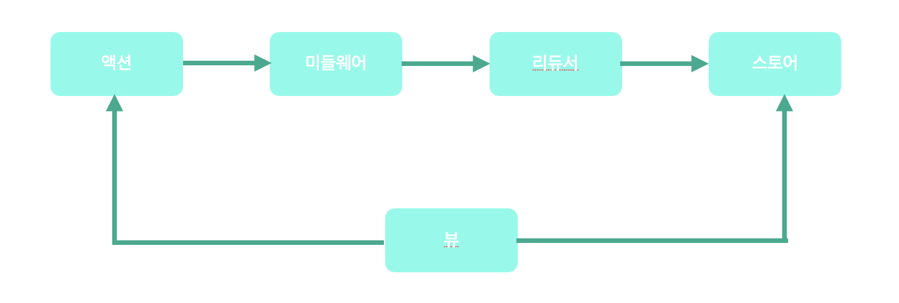

# 리덕스로 상태 관리하기

리덕스(Redux)는 자바스크립트를 위한 상태 관리 프레임 워크다. 리액트를 사용하는 많은 프로젝트에서 리덕스도 같이 사용하는데, 그 이유는 다음과 같다.

- 컴포넌트 코드로 부터 상태 관리 코드를 분리할 수 있다.

- 서버 렌더링 시 데이터 전달이 간편하다.

- 로컬 스토리지에 데이터를 저장하고 불러오는 코드를 쉽게 작성할 수 있다.

- 같은 상탯값을 다수의 컴포넌트에서 필요로 할 때 좋다.

- 부모 컴포넌트에서 깊은 곳에 있는 자식 컴포넌트에 상탯값을 전달할 때 좋다.

- 알림창과 같은 전역 컴포넌트의 상탯값을 관리할 때 좋다.

- 페이지가 전환되어도 데이터는 살아 있어야 할 때 좋다.

## 리덕스 사용시 따라야 할 세 가지 원칙

리덕스 공식 문서에서는 리덕스 사용 시 따라야 할 세 가지 원칙을 설명한다.

- 전체 상탯값을 하나의 객체에 저장한다.
- 상탯값은 불변 객체다.
- 상탯값은 순수 함수에 의해서만 변경되어야 한다.

### 하나의 객체에 프로그램의 전체 상탯값을 저장한다.

전체 상탯값이 하나의 자바스크립트 객체로 표현되기 때문에 활용도가 높아진다.
리덕스를 사용하면 하나의 객체를 직력화해서 서버와 클라이언트가 프로그램의 전체 상탯값을 서로 주고받을 수 있다.
프로그램이 특정한 상태에 있을 때 발생하는 버그를 확인하기 위해 그 상탯값을 저장한 후 반복해서 재현할 수 있다.
최근의 상탯값을 버리지 않고 저장해 좋으면 실행 취소와 다시 실행 기능을 쉽게 구현할 수 있다.

하지만 프로그램의 전체 상탯값을 리덕스로 관리하는 것은 쉬운 일이 아니다.
애니메이션을 위한 데이터나 문자열 입력창의 현재 상탯값은 컴포넌트에서 관리하는 게 나을 수도 있다.
프로그램의 일부 상태만 리덕스를 활용해도 된다.
특별히 로직이 복잡하지 않은 페이지에서는 컴포넌트의 상탯값을 활용하는 게 생산성을 더 높일 수도 있다.
전체 상탯값을 리덕스로 관리하면 시간 여행과 같은 기능을 쉽게 구현할 수 있지만, 그런 기능을 사용하지 않는다면 필요한 곳에서만 리덕스를 사용해도 된다.

### 상탯값을 불변 객체로 관리한다.

```jsx
const incrementAction = {
  type: "INCREMENT",
  amount: 123,
};
const conditionalIncrementAction = {
  type: "CONDITIONAL_INCREMENT",
  amount: 2,
  gt: 10,
  lt: 100,
};
store.dispatch(incrementAction);
store.dispatch(conditionalIncrementAction);
```

액션 객체는 type 속성값이 존재해야 한다.
type 속성값으로 액션 객체를 구분한다.
type 속성값을 제외한 나머지는 상탯값을 수정하기 위해 사용되는 정보다.
액션 객체와 함께 dispatch 메서드를 호출하면 상탯값이 변경된다.

리덕스의 상탯값을 수정하는 유일한 방법은 액션 객체와 함께 dispatch 메서드를 호출하는 것이다.
다른 어떤 방법으로도 상탯값을 수정하면 안 된다. 상탯값은 dispatch 메서드가 호출된 순서대로 리덕스 내부에서 변경되기 때문에 상탯값이 변화되는 과정을 쉽게 이해할 수 있다. 게다가 액션 객체는 평범한 자바스크립트 객체이기 때문에 입력된 순서를 저장해 놓고 나중에 그 과정을 쉽게 재현할 수 있다.

상탯값 수정이라는 하나의 목적만 놓고 보면 불변 객체를 사용하는 것보다는 상탯값을 직접 수정하는 게 더 빠르다. 하지만 이전 상탯값과 이후 상탯값을 비교해서 변경 여부를 파악할 때는 불변 객체가 훨씬 유리하다. 상탯값 변경을 빠르게 확인할 수 있으면 메모제이션과 같은 기능을 활용하기 좋고, 리액트의 렌더링 성능을 올리는데로 유리하다.

### 오직 순수 함수에 의해서만 상탯값을 변경해야 한다.

리덕스에서 상탯값을 변경하는 함수를 리듀서라고 부른다. 리듀서의 구조는 다음과 같다.

```jsx
(state, action) => nextState;
```

리듀서는 이전 상탯값과 액션 객체를 입력으로 받아서 새로운 상탯값을 만드는 순수 함수다. 순수 함수는 부수 효과를 발생시키지 않아야 한다.
또한 순수 함수는 같은 인수에 대해 항상 같은 값을 반환해야 한다. 다음과 같이 반환값을 계산할 때 랜덤 함수나 시간 함수를 이용하면 순수 함수가 아니다.

순수 함수는 테스트 코드를 작성하기 쉽다.

```jsx
const now = new Date();
const hour = now.getHours();
const minute = now.getMinutes();
expect(sayHello1("홍길동")).toBe(
  `홍길동님 안녕하세요. 지금은 ${hour}시 ${minute}분입니다.`
);
```

## 리덕스의 주요 개념 이해하기



그림에서 뷰는 리액트의 컴포넌트라고 생각할 수 있다.
상탯값을 변경하는 과정에서 거치게 되는 리덕스의 네 가지 요소(액션, 미들웨어, 리듀서, 스토어)

... (넘김)
