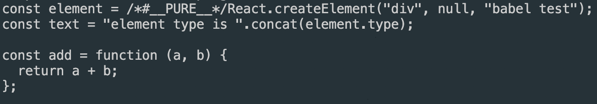
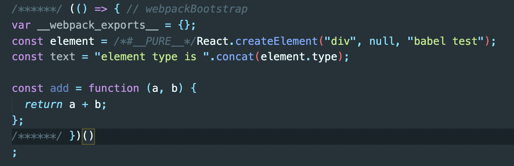

# 바벨

## 바벨을 실행하는 여러가지 방법

- @babel/cli로 실행
- 웹팩에서 babel-loader로 실행하기
- @babel/core를 직접 실행하기
- @babel/register로 실행하기

@babel/register를 이용하면 노드에서 require 코드가 실행 될 때 동적으로 바벨이 실행되게 할 수 있다.

```txt
바벨이란

바벨은 입력과 출력이 모두 자바스크립트 코드인 컴파일러다.
이는 보통의 컴파일러가 고수준의 언어를 저수준의 언어로 변환하는 것과 비교된다.
  초기의 바벨은 ES6 코드를 ES5 코드로 변환해 주는 컴파일러였다. 현재는 바벨을 이용하여 리액트의 JSX 문법, 타입스크립트와 같은 정적 타입언어, 코드 압축, 제안 단계에 있는 문법 등을 사용할 수 있다.
```

```txt
npm init -y
```

먼저 package.json을 만든다.

```txt
npm install @babel/core @babel/cli @babel/plugin-transform-arrow-functions @babel/plugin-transform-template-literals @babel/preset-react
```

그 후 필요한 패키지를 설치한다.
여기서 바벨을 실행하기 위해서는 @babel/core 패키지를 설치해야 한다. 두 개의 플러그인과 프리셋 하나를 추가로 설치했다.

    플러그인(plugin)은 웹팩의 기본적인 동작에 추가적인 기능을 제공하는 속성입니다. 로더랑 비교하면 로더는 파일을 해석하고 변환하는 과정에 관여하는 반면, 플러그인은 해당 결과물의 형태를 바꾸는 역할을 한다고 보면 됩니다.

이제 컴파일할 코드를 작성해 보자. 프로젝트 루트에 src 폴더를 만들고 그 밑에 code.js 파일을 만들자. code.js 파일의 내용은 다음과 같다.

code.js

```jsx
const element = <div>babel test</div>;
const text = `element type is ${element.type}`;
const add = (a, b) => a + b;
```

리액트 프리셋을 이용해서 jsx문법을 변환할 예정이다.  
템플릿 리터럴 플러그인을 이용해서 템플릿 리터럴 코드를 변환할 예정이다.  
 화살표 함수 프러그인을 이용해서 화살표 함수를 변환할 예정이다.

### @babel/cli로 실행하기

이제 @babel/cli로 실행할 준비가 끝났다.

    npx babel src/code.js --presets=@babel/preset-react --plugins=@babel/plugin-transform-template-literals,@babel/plugin-transform-arrow-functions

이렇게 바벨을 실행하면 콘솔에 다음 내용이 출력된다.



jsx 문법은 createElement 함수 호출로 변환된다.  
템플릿 리터럴은 문자열의 concat 메서드 호출로 변환횐다.  
화살표 함수는 일반 함수로 변환된다.  
@babel/cli로 거의 모든 설정값을 표현할 수 있지만, 설정할 내용이 많거나 실행 환경에 따라 설정값이 다른 경우에는 설정 파일을 따로 만드는 게 좋다. 바벨 6까지는 .babelrc 파일로 설정값을 관리했지만, 바벨 7부터는 babel.confing.js 파일로 관리하는 것을 추천한다. 두 파일의 차이점은 뒤에서 설명한다.

```js
const presets = ["@babel/preset-react"];
const plugins = [
  "@babel/plugin-transform-template-literals",
  "@babel/plugin-transform-arrow-functions",
];

module.exports = { presets, plugins };
```

앞에서 @babel/cli 명령어로 입력했던 설정과 같은 내용이다. 자바스크립트 파일이기 때문에 동적으로 설정값을 만들 수 있다.

    npx babel src/code.js

컴파일된 결과를 파일로 저장하고 싶다면 다음과 같이 입력하면 된다.

    npx babel src/code.js --out-file dist.js
    npx babel src --out-dir dist

첫 번째 명령어는 파일 단위로 처리하고, 두 번째 명령어는 폴더 단위로 처리한다.

### 웹팩의 babel-loader로 실행하기

두 번째 방법은 웹팩의 babel-loader로 실행하는 것이다. 웹팩을이용하기 위해 다음과 같이 추가로 패키지를 설치한다.

    npm install webpack webpack-cli babel-loader

프로젝트 루트에 webpack.config.js 파일을 만들고, 다음 내용을 입력한다.

```js
const path = require("path");

module.exports = {
  entry: "./src/code.js", // 1
  output: {
    path: path.resolve(__dirname, "dist"), // 2
    filename: "code.bundle.js",
  },
  module: {
    rules: [{ test: /\.js$/, use: "babel-loader" }], // 3
  },
  optimization: { minimizer: [] }, // 4
};
```

1 웹팩으로 번들링할 파일을 지정한다.  
2 번들링된 결과를 dist/code.bundle.js 파일로 저장한다.  
3 자바스크립트 파일을 babel-loader가 처리하도록 설정한다. babel-loader는 바벨의 설정 파일을 이용하므로 이전에 만들어 놓은 babel.config.js 파일의 내용이 설정값으로 사용된다.  
4 웹팩은 기본적으로 자바스크립트 파일을 압축한다. 그렇지만 바벨이 제대로 실행됐는지 확인하기 위해 압축 기능을 잠시 끄기로 한다.

    npx webpack


